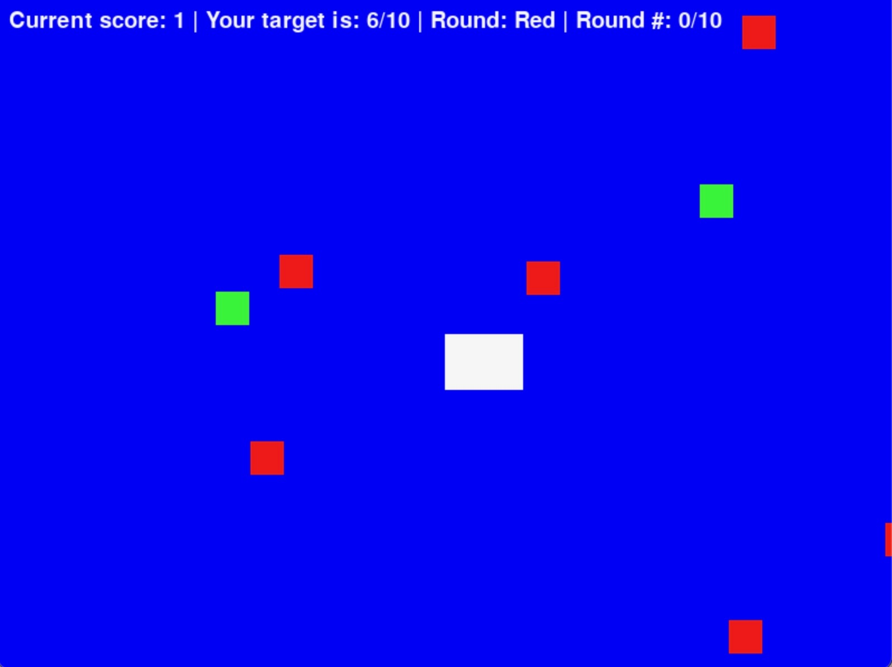

:warning: Everything between << >> needs to be replaced (remove << >> after replacing)

# << Project Title >>
## CS110 B1 Final Project Fall 2024

## Team Members

Stephania Calin, Ava Attina

***

## Project Description

This game is about a mermaid who is attempting to catch fish with a specified color. On the top of the screen, there is be a counter displaying the number of fish that the player has caught. The player must avoid colliding with light blue fish, as the game will end.

***    

## GUI Design

### Initial Design

### Final Design

## Program Design

### Features

1. start menu
2. game over menu
3. timer
4. fish counter
5. obstacle collisions

### Classes

- << You should have a list of each of your classes with a description >>

## ATP

---

### Program: Mermaid Fish Collector Game 

---

### Test Case 1: Mermaid Movement  

| Step |              Procedure              |                Expected Results                 |
|------|:-----------------------------------:|-----------------------------------------------:|
|  1   | Start the game.                       | The game starts with the mermaid visible.       |
|  2   | Press the **Up** arrow key.           | The mermaid moves upward.                       |
|  3   | Press the **Down** arrow key.         | The mermaid moves downward.                     |
|  4   | Press the **Left** arrow key.         | The mermaid moves left.                         |
|  5   | Press the **Right** arrow key.        | The mermaid moves right.                        |

---

### **Test Case 2: Fish Color Collection**  

| Step |              Procedure              |                Expected Results                 |
|------|:-----------------------------------:|-----------------------------------------------:|
|  1   | Start the game.                      | The game starts with the mermaid visible.       |
|  2   | Wait for the "red round" to begin.    | The round indicator displays "Red."             |
|  3   | Use the mermaid to collide with a red fish. | The red fish is collected, and the score increases. |
|  4   | Attempt to collide with a fish of a different color. | The non-red fish is not collected.           |

---

### **Test Case 3: Round Transition**  

| Step |              Procedure              |                Expected Results                 |
|------|:-----------------------------------:|-----------------------------------------------:|
|  1   | Collect the required number of fishes in the current round (e.g., 10 red fishes). | The required fish count is reached.             |
|  2   | Wait for the game to transition to the next round. | The game transitions smoothly to the next round. |
|  3   | Verify that a new color is specified for the round. | The round indicator displays a new color (e.g., Blue). |

---

### **Test Case 4: Score and Seashell Reward**  

| Step |              Procedure              |                Expected Results                 |
|------|:-----------------------------------:|-----------------------------------------------:|
|  1   | Collect a set number of fishes in a round (e.g., 8 fishes). | The fish collection progresses.                 |
|  2   | Complete the round by reaching the target fish count. | The round ends, and the seashell reward is displayed. |
|  3   | Verify that the seashell reward corresponds to the number of fishes collected. | The seashell reward accurately reflects the number of fishes collected. |

---

### **Test Case 5: Graphical Display and Animation**  

| Step |              Procedure              |                Expected Results                 |
|------|:-----------------------------------:|-----------------------------------------------:|
|  1   | Start the game.                      | The game starts with the mermaid and fishes visible on the screen. |
|  2   | Observe the animations of the fishes moving across the screen. | Fishes move smoothly across the screen.         |
|  3   | Verify that the mermaid sprite moves smoothly in response to controls. | The mermaid moves smoothly in the specified direction. |
|  4   | Check that collected fishes disappear from the screen. | Collected fishes disappear instantly from the game view. |
|  5   | Observe the transition animations between rounds. | Smooth transition animations occur between rounds. | 
